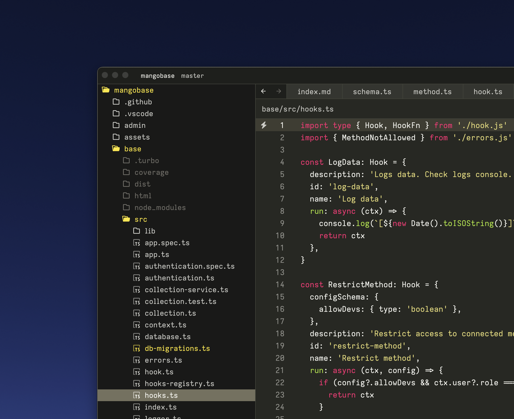

# theme-to-zed

Export VSCode themes to Zed.

⚠️ Zed works for just Mac at the moment. So this extension is only useful for Mac users.

Marketplace link: [degreat.theme-to-zed](https://marketplace.visualstudio.com/items?itemName=degreat.theme-to-zed)


<figcaption>Zed with Monokai exported from VSCode</figcaption>

## How to use

After installing from the Marketplace, run the command `Export Theme to Zed` from the command palette. You may be asked to install `theme_importer` if it's not already installed. This process may take a while.

Restart Zed (Preview) to see the theme.

If you're on an Intel Mac, you may need to supply the path to `theme_importer` in `settings.json`.

```json
{
  ...,
  "theme-to-zed.theme_importer": "/usr/local/bin/theme_importer"
}
```

⚠️ Note that, not all themes may work properly. The `theme_importer` is still under development. You may need to update periodically.

🌵 The installation of `theme_importer` will only happen once.

🏄🏽 Run `Update Zed theme_importer` periodically to update the binary of `theme_importer` to latest.